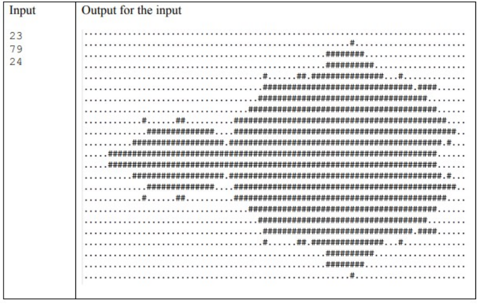

# MandelbrotSet_OpenMP


The Mandelbrot set is a set of complex numbers. [This code](mandelbrotParalel.cpp) parallelizes the mandelbrot using OpenMP.





## Getting started

- Download this project;
- [Read the report](TechnicalReport_MandelbrotSetOpenMP.pdf) (written in brazilian portuguese).

## Compiling

```
g++ mandelbrotParalel.cpp -o a.out -std=c++11 -fopenmp

time ./a.out
```

The output of mandelbrot is printed in a *.txt* file.


## Results

I used a Intel® Core™ i7-2600 CPU @ 3.40GHz × 8, 4 physical cores and 4 logical cores, 8 GB of RAM and Ubuntu 16.04 LTS 64-bit operating system to run the tests.

#### Input: 
- 1024 rows;
- 768 columns;
- 18000 iterations.

| Threads | Time | Speedup | Efficiency | Cost |
| --- | --- | --- | --- | --- |
| 1 | 582 | 1 | 100% | 582 |
| 2 | 287,4 | 2,025 | 101,25% | 574,8 |
| 4 | 158,3 | 3,676 | 91,9% | 633,2 |
| 8 | 103 | 5,650 | 70,625% | 824 |
| 16 | 104 | 5,596 | 69,95% | 832 |

#### This was an assignment for Parallel and Distributed Programming class by Ph.D Marcelo Trindade Rebonatto from University of Passo Fundo.

